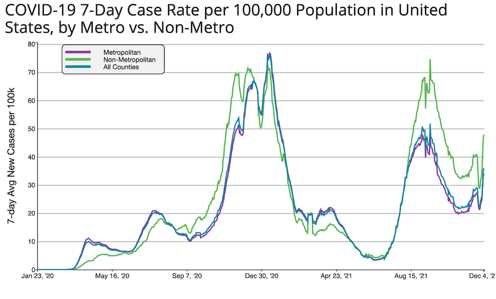
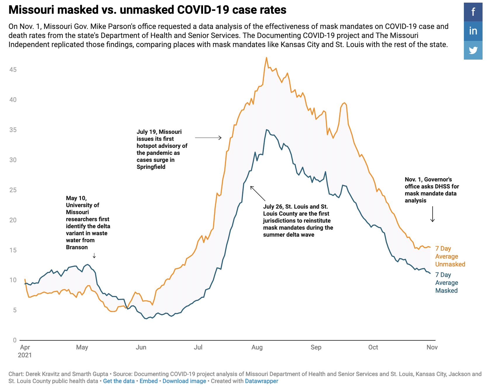
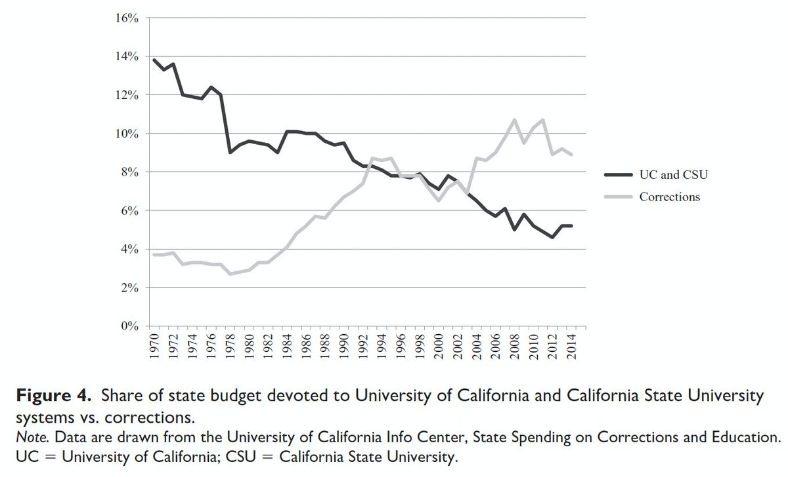
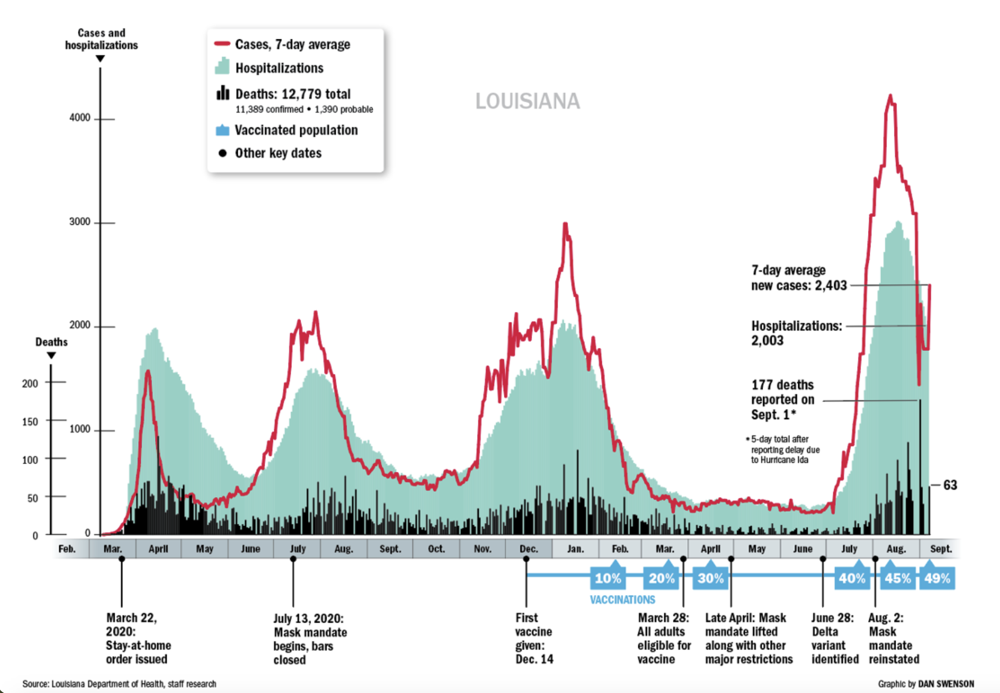
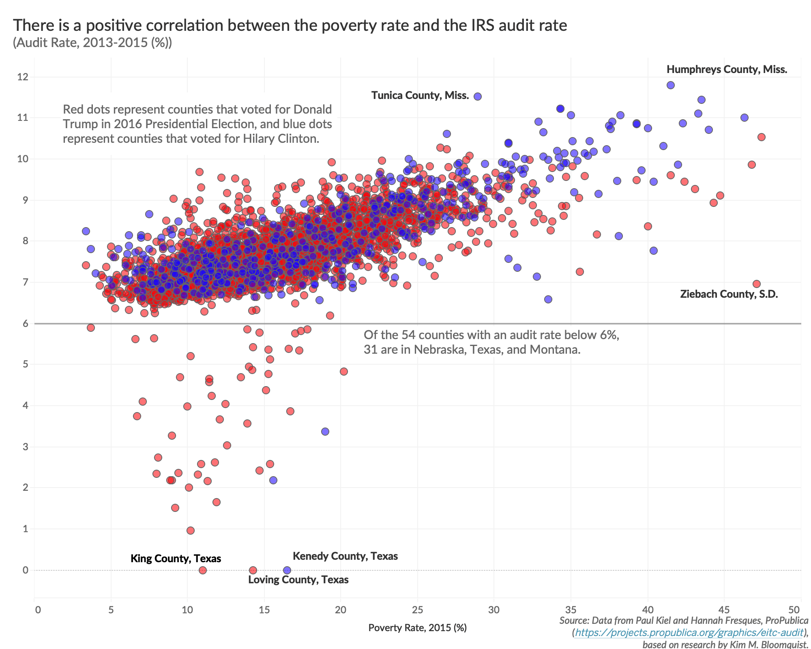
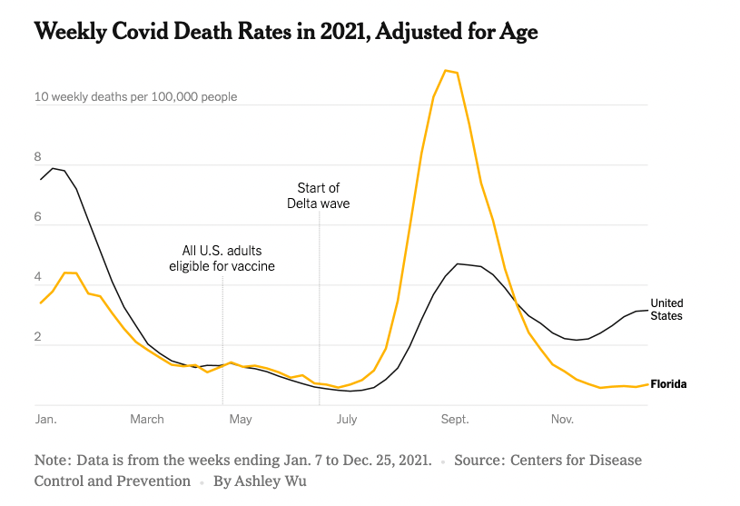
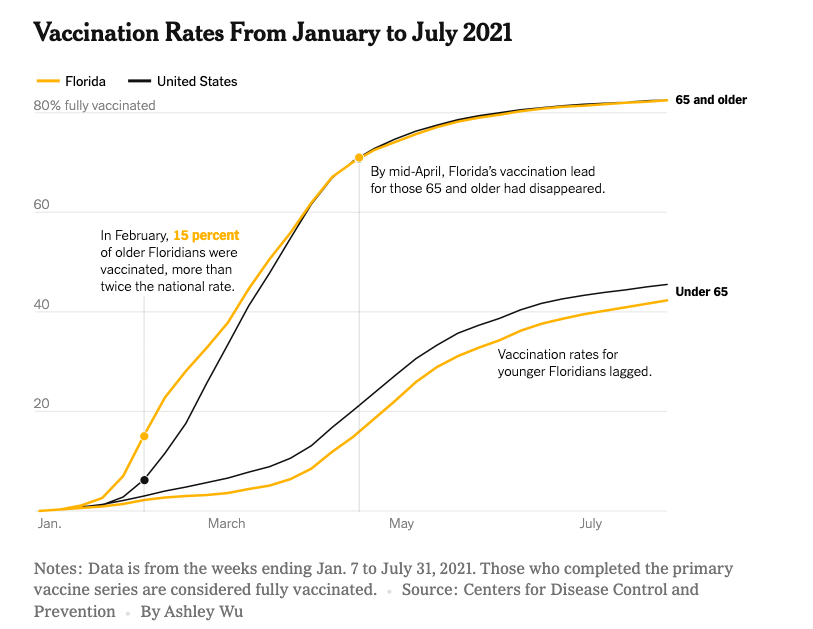

# Examples of Combining Datasets in Visualizations

These are a couple nice examples of combining datasets in visualizations. 

## US COVID Case Rates and US County Demographics

I saw this visualization through a tweet by @agsciencewriter (account no longer exists). It was based on data from the CDC when they were reporting COVID data regularly. 

Data combinations:
* COVID case rate by county
* US county metro vs. non-metro classification, available from the USDA, <https://www.ers.usda.gov/data-products/rural-urban-continuum-codes/>

## Missouri Mask Mandates and COVID Case Rates

This visualization comes from an article in the *Missouri Independent* news, ["Missouri health department found mask mandates work, but didn’t make findings public"](https://missouriindependent.com/2021/12/01/missouri-health-department-found-mask-mandates-work-but-didnt-make-findings-public/) ([larger version w/tooltips](https://datawrapper.dwcdn.net/gSx9f/4/))

It splits out the case rates in St. Louis, St. Louis County, Kansas City and Jackson County (all with mask mandates) from the rest of the state. They found that "jurisdictions with mask mandates averaged 15.8 cases per day for every 100,000 residents, compared to 21.7 in unmasked communities."

Data combinations:
* COVID case data by county 
* Set of counties that had mask mandates
* Dates of significant events around Delta, case surges, and mask mandates

## California Spending on Universities and Dept of Corrections

"This shocking graph is from a new @SREJournal article by Hamilton, Nielsen, and Larma. Over the past 50 years, California state budget priorities for university and incarceration have dramatically reversed. As HE funding declines, minority students suffer."  
Source: https://twitter.com/nathanihoff/status/1465454549385105410

Data combinations:
* Amount of state funding for University of California and California State University systems
* Amount of state funding for corrections (jails and prisons)

Note that the raw amounts aren't used, but rather the share of the state budget those amounts represent.  This allows the lines to be drawn on the same chart with the same scale.

## Louisiana COVID Cases, Deaths, Vaccinations

This visualization comes from an article in *The Times-Picayune | The New Orleans Advocate*, ["Louisiana COVID numbers: Data on cases, deaths, hospitalizations, vaccines"](https://www.nola.com/news/coronavirus/article_7cb2af1c-6414-11ea-b729-93612370dd94.html) ([archived version, Sep 2021](http://web.archive.org/web/20210927011921/https://www.nola.com/news/coronavirus/article_7cb2af1c-6414-11ea-b729-93612370dd94.html))

Data combinations:
* COVID cases, 7-day average
* COVID hospitalizations
* COVID deaths
* COVID vaccination percentages
* key dates related to mask mandates, Delta variant, and vaccine availability

## US Poverty Rate, IRS Auditing Rate, and 2016 Political Affiliation

This visualization comes from ["Geographic Distribution of IRS Auditing Rates"](https://policyviz.com/2019/05/02/geographic-distribution-of-irs-auditing-rates/) in PolicyViz.com. 

Data combinations:
* US poverty rate by county, from <https://data.census.gov/table/ACSST5Y2022.S1701?q=poverty&g=010XX00US$0500000>
* IRS auditing rate by county, from <https://www.propublica.org/datastore/dataset/irs-audit-rates-by-county>
* [Voting in the 2016 US Presidential Election](https://github.com/tonmcg/US_County_Level_Election_Results_08-20), from <https://github.com/tonmcg>

## Florida vs. US Covid Deaths in 2021

This has two charts as examples and comes from a *New York Times* article, ["The Steep Cost of Ron DeSantis' Vaccine Turnabout"](https://www.nytimes.com/2023/07/22/us/politics/ron-desantis-covid.html), July 2023.  These are good examples of adding context to charts to aid in understanding.

Data combinations:
* COVID death rates in Florida
* COVID death rates in US, average
* context of when vaccines were eligible and when the Delta wave began

Data combinations:
* Vaccination rates in Florida, split by "under 65" and "65 and older"
* Vaccination rates in US, split by "under 65" and "65 and older"

In particular, this chart adds context to help the viewer understand what's being shown in the chart, explaining specific data points. This also shows how data from a single dataset can be split based on a categorical grouping to highlight differences between groups.
